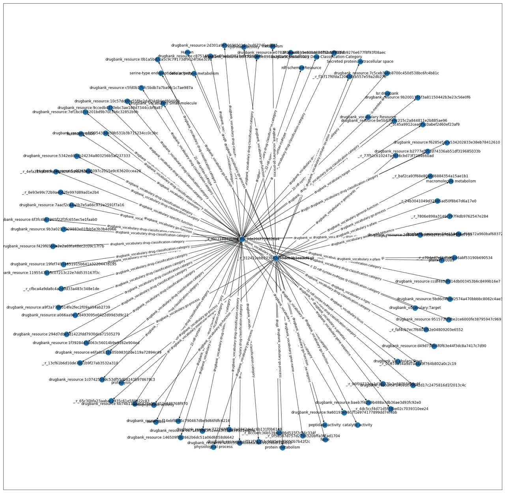

## **RDF_Clustering**

Lo stato attuale della libreria presenta i seguenti file, le cui funzioni vengono descritte nel dettaglio all'interno delle docstrings di classi e metodi.
1. **main_nb.ipynb**: notebook python in cui è possibile eseguire step-by-step ogni passaggio necessario all'analisi delle risorse.
Il file è pensato per essere facilmente modificabile (parzialmente o interamente) per adattarlo a utilizzi differenti.

    Brevemente gli step eseguiti sono:
   * Import delle triple come grafo
   * Trasformazione del grafo (rdflib) in knowledge graph, escludendo i predicati passati come parametro
   * Estrazione dei knowledge graph relativi ad ogni risorsa di tipo Drug presente
   * Estrazione degli embeddings per ogni grafo tramite algoritmo **rdf2vec**
   * Applicazione di un algoritmo di clustering (in questo caso **K-Means**)
   * Selezione dei grafi corrispondenti a due risorse appartenenti allo stesso cluster
   * Applicazione dell'algoritmo **LCS** ed estrazione del grafo risultante
   * Rappresentazione grafica del grafo risultante e salvataggio in file in formato 'nt'
   * Applicazione dell'algoritmo **PCA**, prima su 2 e poi su 3 principal components, in modo da poter aver avere una rappresentazione grafica (2D e 3D) dei cluster
   
2. **knowledge_graph.py**: contenente le classi Vertex e KnowledgeGraph, con le relative funzioni necessarie per trasformazione da/in rdflib.graph, interazione con i diversi nodi del grafo, aggiunta/rimozione di risorse, rappresentazione grafica.
3. **lcs_graph.py**: contenente la classe LCSGraph (derivata da KnowledgeGraph), che va ad aggiungere alla classe grafo alcune funzioni prettamente collegate alla costruzione del grafo LCS.
4. **LCS.py**: contenente il metodo principale per creare il grafo LCS risultante di due grafi. In questo metodo sono incluse tutte le funzioni necessarie per la corretta creazione del grafo in formato rdflib.graph. Vengono dati come input i due grafi da analizzare, la profondità massima, il set di 'uninformative triples' e il set di 'stopping patterns'.
5. **rdf_graph_utils.py**: contenente alcune funzioni ausiliarie per rappresentazione e salvataggio di un grafo.
6. **rdf2vec.py**: contenente tutte le funzioni relative all'estrazione degli embeddings tramite algoritmo 'rdf2vec'.

Le **'uninformative triples'** vengono fornite come lista di URI di predicati in un file in formato 'tsv'.

Gli **'stopping patterns'** vengono forniti come lista di condizioni FILTER in un file in formato 'tsv'.

Il grafo risultante dall'algoritmo LCS viene salvato in formato 'nt'.

### Esempio di rappresentazione grafica 3D dei cluster dopo applicazione di PCA.

### Esempio di rappresentazione grafica 2D del grafo risultante dall'algoritmo LCS applicato a due grafi di risorse appartenenti allo stesso cluster.

