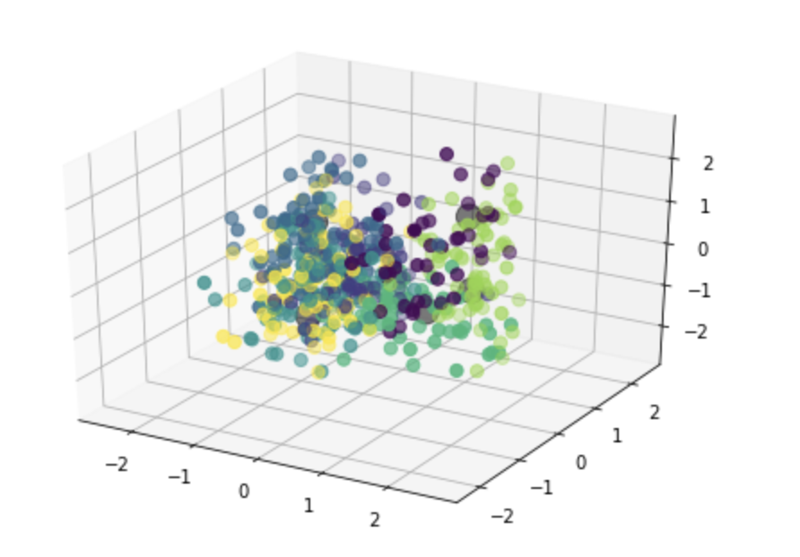

## **RDF_Clustering**

Lo stato attuale della libreria presenta i seguenti file, le cui funzioni vengono descritte nel dettaglio all'interno delle docstrings di classi e metodi.
1. **main_nb.ipynb**: notebook python in cui è possibile eseguire step-by-step ogni passaggio necessario all'analisi delle risorse.
Il file è pensato per essere facilmente modificabile (parzialmente o interamente) per adattarlo a utilizzi differenti.

    Brevemente gli step eseguiti sono:
   * Import delle triple come grafo
   * Trasformazione del grafo (rdflib) in knowledge graph, escludendo i predicati passati come parametro
   * Estrazione dei knowledge graph relativi ad ogni risorsa di tipo Drug presente
   * Estrazione degli embeddings per ogni grafo tramite algoritmo **rdf2vec**
   * Applicazione di un algoritmo di clustering (in questo caso **K-Means**)
   * Selezione dei grafi corrispondenti a due risorse appartenenti allo stesso cluster
   * Applicazione dell'algoritmo **LCS** ed estrazione del grafo risultante
   * Rappresentazione grafica del grafo risultante e salvataggio in file in formato 'nt'
   * Applicazione dell'algoritmo **PCA**, prima su 2 e poi su 3 principal components, in modo da poter aver avere una rappresentazione grafica (2D e 3D) dei cluster
   
2. **knowledge_graph.py**: contenente le classi Vertex e KnowledgeGraph, con le relative funzioni necessarie per trasformazione da/in rdflib.graph, interazione con i diversi nodi del grafo, aggiunta/rimozione di risorse, rappresentazione grafica.
3. **lcs_rdf_graph.py**: contenente la classe LCSGraph e tutte le funzioni necessarie per la corretta creazione del grafo in formato rdflib.graph. Vengono dati come input i due grafi da analizzare, la profondità massima, il set di 'uninformative triples' e il set di 'stopping patterns'.
4. **rdf_graph_utils.py**: contenente alcune funzioni ausiliarie per rappresentazione e salvataggio di un grafo.
5. **rdf2vec.py**: contenente tutte le funzioni relative all'estrazione degli embeddings tramite algoritmo 'rdf2vec'.


Le **'uninformative triples'** vengono fornite come lista di URI di predicati in un file in formato 'tsv'.

Gli **'stopping patterns'** vengono forniti come lista di condizioni FILTER in un file in formato 'tsv'.

Il grafo risultante dall'algoritmo LCS viene salvato in formato 'nt'.


### Algoritmo LCS
Tramite il metodo **"new_lcs"** contenuto in **LCS.py**, viene avviata la costruzione del grafo risultante dal LCS.
Vengono dati in input gli starting node dei due grafi di partenza, i due grafi e la profondità massima richiesta nella ricerca dei CS.
Viene creato un nuovo oggetto di tipo KnowledgeGraph, a cui andremo ad aggiungere di volta in volta tutti i vertici in comune e i nodi blank.
Una volta creato e aggiunto il nodo di partenza (blank se diversi), viene avviato il metodo ricorsivo 'walk'.
Questo andrà a ricercare tutti i neighbors (in modo alternato saranno predicati e oggetti) per aggiungere al grafo risultante ogni vertice comune o i blank nodes.


Al termine della ricerca, viene lanciata la funzione **"clean_blank_branch"**, che rimuove dal grafo ogni **uninformative triple**, in quanto non danno alcuna informazione utile alla costruzione del LCS.
Una tripla viene considerata uninformative nel momento in cui l'oggetto della tripla è un nodo blank senza nodi figli, e il predicato è anch'esso un nodo blank o contenuto nella lista di predicati passati come parametro.


Per la rimozione degli **stop patterns**, viene convertito nuovamente il grafo in rdflib.graph in modo da poter applicare facilmente una query SPARQL. 

Vengono quindi selezionati tutti i risultati andando ad applicare nel campo FILTER della query tutte le condizioni passate come parametro nella list 'stop_patterns'.


### Algoritmo RDF2Vec
Al fine di convertire ogni grafo di ogni singola risorsa in un set di features utilizzabili per qualsiasi algoritmo di Machine Learning (supervised o unsupervised), è stato utilizzato l'algoritmo **RDF2Vec**.
Questo non è altro che un'evoluzione dell'algoritmo **Word2Vec** al fine di poter essere applicato a risorse RDF.
Brevemente, Word2Vec utilizza una rete neurale su 2 layer molto efficiente dal punto di vista computazionale, al fine di estrarre degli embeddings per la rappresentazione di un testo in forma vettoriale, in relazione al contesto.
Risulta particolarmente utile in quanto permette di ridurre ad un **numero fisso** il numero di features associate al singolo samples, che potrebbero altresì arrivare anche a decine di migliaia di valori nel momento in cui vengono utilizzati vettori in cui ad ogni parola corrisponde un valore binario, risultando particolarmente inefficienti per problemi di Machine Learning.


L'algoritmo **RDF2Vec** permette appunto di applicare questo ragionamento a risorse non in forma testuale, ma in forma di grafo RDF. Per fare questo vengono seguiti di volta in volta un numero definito di percorsi casuali all'interno del grafo, al fine di generare delle vere e proprie frasi a partire dal nodo radice.
Una volta generato il set di sentence associato ad una specifica risorsa, queste vengono date in pasto al modello Word2Vec, che ne permette di estrarne gli embeddings in modo analogo a come verrebbe fatto su samples testuali.


Esempio di embeddings ottenuti per la risorsa <http://bio2rdf.org/drugbank:DB00088> con dimensione del vettore pari a 200 e numero di random walks pari a 500:
```
[-0.13579929  0.10634991 -0.19508587  0.13740389  0.38226447  0.0082841  -0.18999708  0.07511245 -0.05183074 -0.2520642  -0.0540712  -0.15153484
 -0.04447071 -0.16060801  0.05534524  0.1488969  -0.27106872  0.3042951  -0.05097584 -0.05965914 -0.44421697 -0.25543192 -0.08128304  0.09806249
 -0.2019982   0.20640387  0.23951831 -0.01821028  0.38302115  0.05290831  0.20518596  0.17835723  0.08116619  0.02235514 -0.25621486 -0.11301162
 -0.30324066 -0.11542427  0.0052605   0.03931064  0.07225893  0.38304454  0.08830022 -0.0689913  -0.17660433  0.06619848  0.24241337  0.27934432
 -0.5490026   0.0085024  -0.18012963 -0.06430514  0.5124184   0.1760997  -0.01199443 -0.23589316 -0.2917533   0.25213343 -0.13965419  0.16451903
  0.36159495 -0.10520194  0.04550585 -0.3518131   0.04775634  0.1455451   0.08535515 -0.19351435 -0.07632845 -0.1885232  -0.06593035 -0.36776882
 -0.11818709 -0.13130622  0.17677292  0.21360831  0.13164225 -0.10057025  0.22856802 -0.25652778  0.01541908  0.19481231 -0.01119623  0.31428728
 -0.23335226 -0.12051576 -0.22600462 -0.3487662  -0.01172311  0.09352148 -0.24118307  0.00457769 -0.01344038 -0.3784722  -0.13564773  0.09516955
  0.0465535   0.01074586 -0.19595556 -0.03338391 -0.05918363 -0.11147053  0.28073597 -0.04730354 -0.13128945  0.25032002 -0.1699154  -0.0395376
 -0.16214436 -0.2941295  -0.09963492  0.12457152 -0.07245671 -0.06998075 -0.02479224  0.05105342  0.15119554  0.0797404  -0.12500869  0.3840678
  0.20990327 -0.0318587  -0.01909847  0.11837319  0.02871554  0.05766431  0.14331657 -0.24225451 -0.11251447  0.20521797  0.09640031 -0.00540827
  0.30853492 -0.14231935  0.06669787 -0.07798418 -0.11699247 -0.4345863  -0.29091752  0.13398331  0.21376589  0.46988657  0.07265633  0.26381826
 -0.05817781  0.05865057  0.24774928  0.2592756   0.10303797  0.04416439 -0.34092045  0.06100131 -0.25364804 -0.15913294 -0.2578499  -0.10758999
  0.37180853 -0.23875105 -0.14646898  0.21261767  0.36493602  0.0542264  -0.01120311 -0.06850688  0.16568545 -0.14696917 -0.22677661 -0.27498108
 -0.17378461 -0.23214898 -0.27653787 -0.33228374 -0.36161956  0.1761771   0.13374616 -0.2206372  -0.11339235  0.0738223  -0.14293158  0.10892296
  0.06202933  0.02281795  0.13637419 -0.15829837 -0.11657436 -0.37201375 -0.0049914  -0.15526593 -0.05727981  0.11215524 -0.04737642  0.07021286
  0.08387566 -0.18921168 -0.02084315 -0.32671297  0.16222855 -0.25613862  0.2915919  -0.05093393]
```
Per quanto una rappresentazione numerica di questo tipo possa risultare completamente incomprensibile all'occhio umano, le caratteristiche di ogni risorsa vengono non solo rese facilmente computabili da altri algoritmi matematici, ma soprattutto interamente preservate.
Questo aspetto è particolarmente evidente nella rappresentazione delle risorse in un grafico 2D/3D, ottenuto grazie alla PCA, sia nel nostro caso di studio che in quello del paper di riferimento degli sviluppatori dell'algoritmo stesso ( <http://semantic-web-journal.net/system/files/swj1643.pdf> ).
Risorse tra loro affini restano infatti facilmente collegabili tra loro, evidenziando appunto come venga preservato il significato originale delle "sentence" estratte dai rispettivi grafi.


### Caso di studio
Nel nostro caso di studio, è stato analizzato l'intero dataset DrugBank, con l'obiettivo di estrarre le informazioni relative a risorse di tipo 'Drug', applicare su di esse un algoritmo di Clustering e confrontare le risorse appartenenti ad un medesimo cluster tramite algoritmo Least Common Subsumer.

Per ogni risorsa Drug, viene estratto il relativo sub-graph con profondità massima pari a 2 (scelta progettuale). Ogni singolo grafo conterrà quindi le triple relative alla rispettiva Drug, e ai predicati e oggetti delle triple di livello 1.

Completata l'estrazione dei grafi, questi vengono dati in pasto all'algoritmo RDF2Vec in modo da associare ad ogni Drug un set di features numeriche (embeddings).

La nuova matrice ottenuta può essere quindi facilmente utilizzata come dataset per l'algoritmo di clustering K-Means. Dopo un'analisi antecedente allo sviluppo, si è deciso di utilizzare un numero di cluster pari a 7.

Dopo aver completato l'esecuzione dell'algoritmo K-Means, si è andati a valutare coppie di risorse appartenenti allo stesso cluster e a cluster differenti tramite l'algoritmo LCS.
L'estrazione dei Least Common Subsumer ha reso subito visibile il grande numero di nodi in comune nei grafi di risorse collocate nello stesso cluster, a differenza di grafi di risorse collocate in cluster differenti.

Andando poi ad analizzare l'output testuale dell'analisi LCS, è possibile dare maggiore significato al raggruppamento in cluster, evidenziando a quali aspetti di ogni risorsa è stata data maggior importanza nella suddivisione.

Si è poi andati a valutare quale fosse stato il risultato ottenuto per due risorse Drug molto simili tra loro prese come esempio, ovvero Heparin (<http://bio2rdf.org/drugbank:DB01109>) e Ardeparin (<http://bio2rdf.org/drugbank:DB00407>).
Le due drug sono state collocate dall'algoritmo nel medesimo cluster, ottenendo un ulteriore riscontro della corrispondenza tra somiglianza evidenziata tramite LCS e posizionamento delle risorse all'interno dello stesso raggruppamento.


### Esempio di rappresentazione grafica 3D dei cluster dopo applicazione di PCA.


